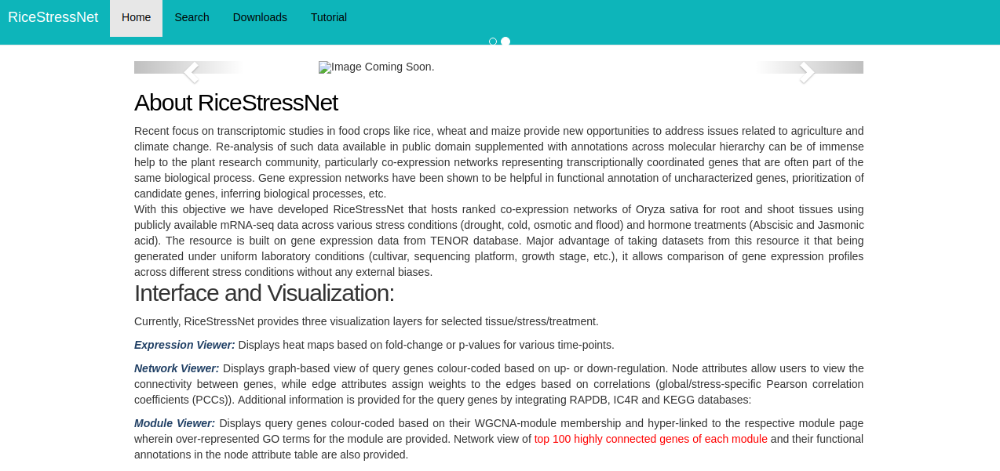
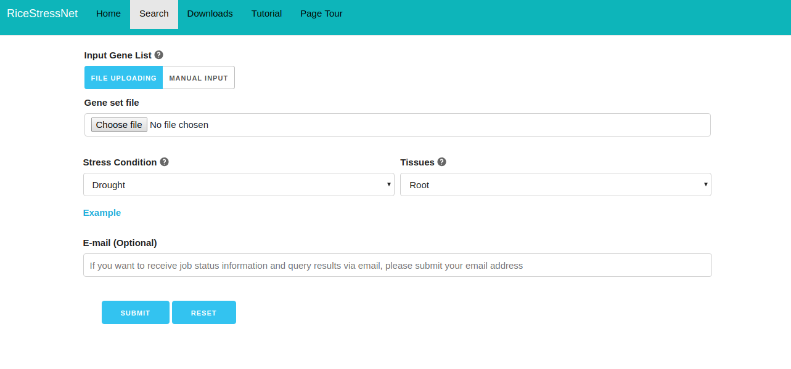
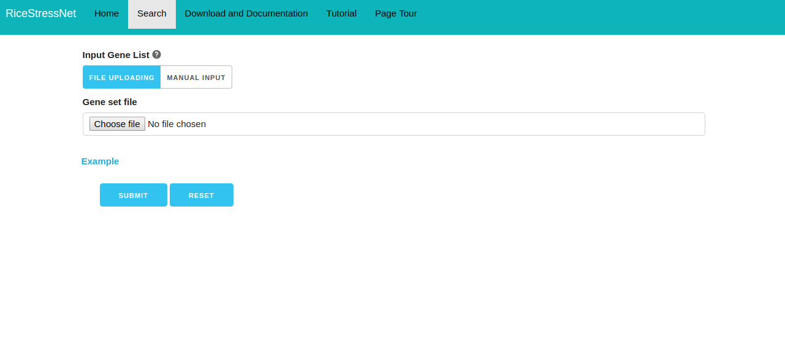
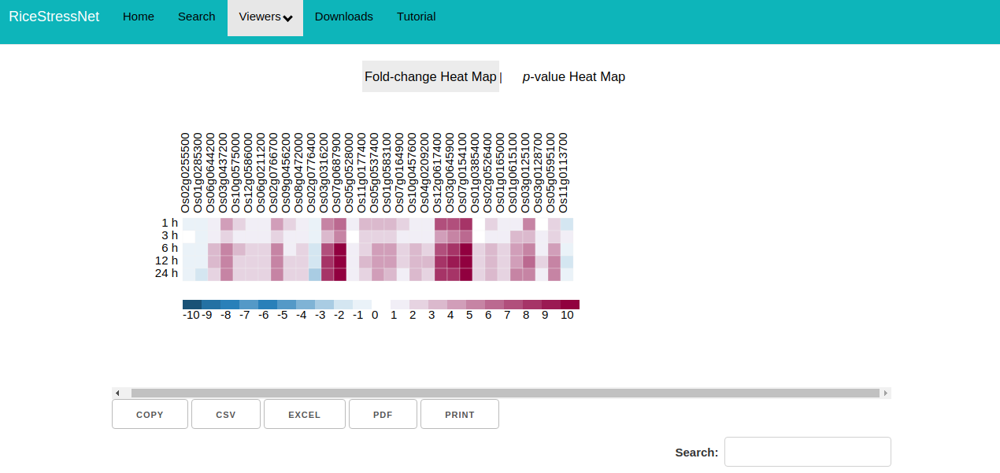
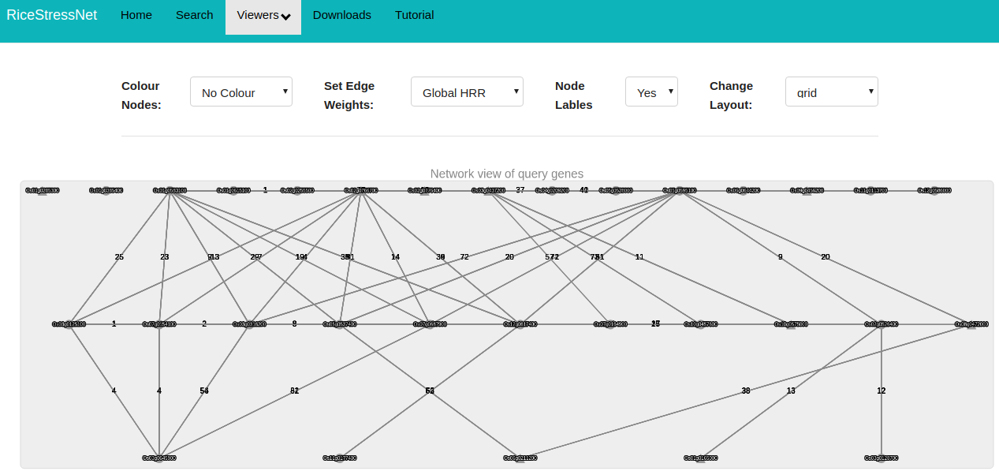
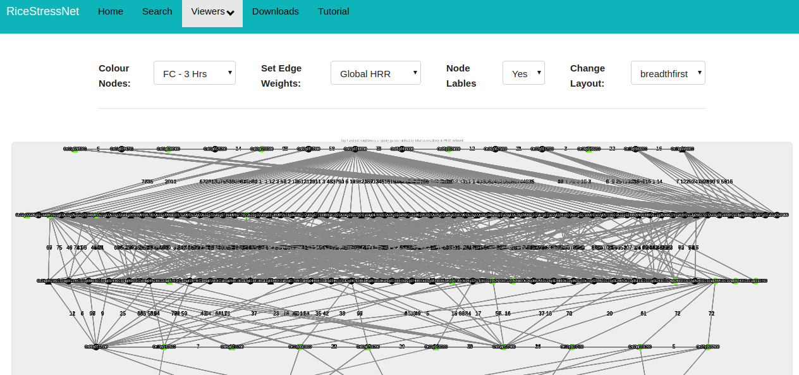

# NetRex
[NetREx Link](http://bioinf.iiit.ac.in/ricenet/ricenetwork/)
### FIles and Folder Information

| File | Description |
| ------ | ------ |
| application | Contains all the php files and HTML files for the application. It also contains all the config details. |
| assets | This contains all the css and javascript files |
| assets_intro | This folder contains tutorial feature of the application. | 
| system, index.php, composer.json, license.txt, readme.rst, contributing.md | Codeigniter internal |
| uploads | Place where whatever the user uploads from the application can be stored. |
| user_guide | Codeigniter Guide. | 
| Neo4j | contains all the required information about Neo4j installation, cypher query language, graph database structure, etc |
| MySQL | Contains complete information about Mysql database Structure used for NetREx, installation steps, etc. |

### Views

