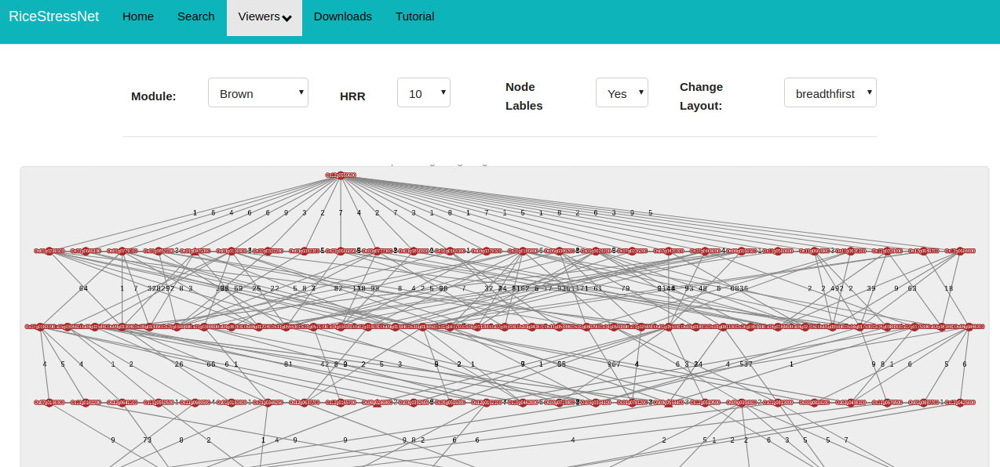

# NetRex
[NetREx Link](http://bioinf.iiit.ac.in/ricenet/ricenetwork/)
### FIles and Folder Information

| File | Description |
| ------ | ------ |
| errors | CodeIgniter Internals. Can be used for error handling. |
| browse.php | This file contains the php code for browsing the data present on the server.  |
| contact-us.php | This file contains code for creating the contact-us form. | 
| download.php | This is view file for viewing the download and documentation page. |
| download_documentation.php | This is view file for viewing the download and documentation page. |
| faq.php | This file contains code for creating the faq page. |
| gene.php | This file is used to view results of the gene API. | 
| index_page.php | This is the home page of the application. |
| network_viewer.php | This page contains the view file for network viewer. |
| network_search.php | This creates the search form for the network search page. |
| pathway-form.php | This creates the input form for the pathview search form. |
| pathway.php | This is view file containing the code for visualizing the pathway. |
| result.php | This is the main file which contains the code for all the different viewers (heat maps, network viewers, network neighbourhood viewer, module viewer). |
| index_page.php | This is the home page of the appli cation. |
| index_page.php | This is the home page of the application. |
| MySQL | Contains complete information about Mysql database Structure used for NetREx, installation steps, etc. |

### Views

